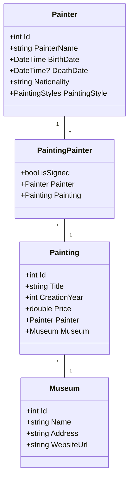

# Project .NET Framework

* Naam: Rahib Pashayev
* Studentennummer: 015652261
* Academiejaar: 2023-2024
* Klasgroep: ISB204A
* Onderwerp: Painter \* -\* Painting \* -1 Museum

## Sprint 3

### Beide zoekcriteria ingevuld
```sqlite
    SELECT "p"."Id", "p"."CreationYear", "p"."Price", "p"."Title"
    FROM "Paintings" AS "p"
    WHERE (@__title_0 = '' OR instr(lower("p"."Title"), @__title_0) > 0) AND "p"."CreationYear" = @__year_1
```
### Enkel zoeken op titel
```sqlite
    SELECT "p"."Id", "p"."CreationYear", "p"."Price", "p"."Title"
    FROM "Paintings" AS "p"
    WHERE @__title_0 = '' OR instr(lower("p"."Title"), @__title_0) > 0
```
### Enkel zoeken op jaar
```sqlite
    SELECT "p"."Id", "p"."CreationYear", "p"."Price", "p"."Title"
    FROM "Paintings" AS "p"
    WHERE "p"."CreationYear" = @__year_0
```
### Beide zoekcriteria leeg
```sqlite
    SELECT "p"."Id", "p"."CreationYear", "p"."Price", "p"."Title"
    FROM "Paintings" AS "p"
```

## Sprint 4



## Sprint 6

### Nieuwe museum

#### Request
```http request
POST  https://localhost:7118/api/Museums
Accept: application/json
Content-Type: application/json

{
  "name": "The Smithsonian",
  "address": "10th St. & Constitution Ave. NW, Washington, DC 20560, United States",
  "websiteUrl": "https://naturalhistory.si.edu/"
}
```

#### Response
```http request
HTTP/1.1 201 Created
Content-Type: application/json; charset=utf-8
Date: Tue, 26 Dec 2023 23:26:54 GMT
Server: Kestrel
Location: https://localhost:7118/api/Museums/6
Transfer-Encoding: chunked

{
  "id": 6,
  "name": "The Smithsonian",
  "address": "10th St. & Constitution Ave. NW, Washington, DC 20560, United States",
  "websiteUrl": "https://naturalhistory.si.edu/",
  "paintings": []
}
```